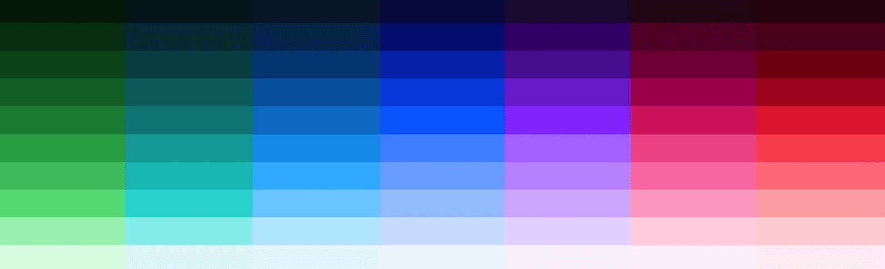

<PageDescription>

<<<<<<< HEAD
The `<Title>` component is used to provide a title to a subsequent component (table, image, video, code block). The `Title` should be used in favor of other techniques for bolded text (`h4`s) to preserve page structure and heading hierarchy.
=======
The `<Title>` component is used to provide a title to a subsequent component (image, video, code block). The `Title` should be used in favor of other techniques for bolded text (`h4`s) to preserve page structure and heading hierarchy.
>>>>>>> 03e1828f880d92a523d8e0316f116ccd7d462552

</PageDescription>

## Example

<Title>This is a title</Title>

<<<<<<< HEAD

=======

>>>>>>> 03e1828f880d92a523d8e0316f116ccd7d462552


## Code

```jsx path=components/Title/Title.js src=https://github.com/carbon-design-system/gatsby-theme-carbon/tree/master/packages/gatsby-theme-carbon/src/components/Title
<Title>This is a title</Title>

<<<<<<< HEAD

```
=======

```
>>>>>>> 03e1828f880d92a523d8e0316f116ccd7d462552
